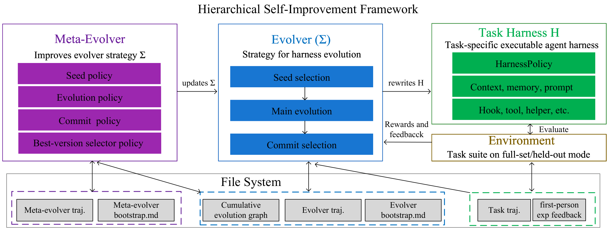

# Hierarchical Self-Improvement: A Framework for Task-Specific Evolvable Agent Harnesses

HSI is a framework in which a single frozen LLM $M$ operates across three layered scopes — **task harness**, **evolver**, and **meta-evolver** — to rewrite its own harness code, the strategy that governs the rewriting, and the selector that exports the final deployed version. The meta-evolver's own execution logic is frozen as an outer anchor, localizing self-modification to layered, empirically validated edits rather than unrestricted self-reference. A thinking-on/off design isolates the harness contribution: thinking is disabled at task time to cap the model's per-step ceiling, and enabled when rewriting the harness to give self-modification its best chance.

On BALROG with DeepSeek-V4-Flash as the frozen backbone, HSI yields consistent in-distribution gains over the init-harness baseline on moderate-difficulty tasks (**+39.3** on BabyAI, **+33.0** on Crafter, **+25.0** on TextWorld, **+15.0** on MiniHack, all in raw % Progress), surpassing several frontier models on TextWorld (Grok-4, Claude-Opus-4.5-Thinking, Gemini-3-Flash) and Crafter (DeepSeek-R1, GPT-5-minimal-think, GPT-4o) despite a smaller backbone, and shows clean held-out generalization on easier BabaIsAI sub-suites (**0.98** best-test on BreakStop, **1.00** on GoTo from a 20% unseen split). On tasks beyond the backbone's reach (NLE), no harness redesign closes the gap.



*Figure 1: The HSI framework. A single frozen LLM $M$ operates across three layered scopes with disjoint editable surfaces: the task-harness scope (executing $H$ on the environment), the evolver scope (rewriting $H$ through seed selection, main evolution, and commit selection), and the meta-evolver scope (rewriting the evolver strategy $\Sigma$ through meta-evolution, plus the terminal best-version selection stage).*

## Results

### Setup A — In-distribution (resampled-seed, full-suite evolution)

| LLM | BabyAI | Crafter | TextWorld | MiniHack | NLE | Avg |
|---|---|---|---|---|---|---|
| Gemini-3-Pro | 96.0 ± 2.8 | 57.3 ± 4.4 | 60.2 ± 7.5 | 40.0 ± 7.7 | 6.8 ± 3.2 | 52.1 ± 5.1 |
| Gemini-3.1-Pro-Thinking | 98.0 ± 2.0 | 55.0 ± 6.4 | 75.7 ± 6.4 | 27.5 ± 7.1 | 2.6 ± 0.3 | 51.8 ± 4.4 |
| Gemini-3.1-Pro | 100.0 ± 0.0 | 46.8 ± 4.2 | 66.5 ± 7.5 | 35.0 ± 7.5 | 3.0 ± 0.5 | 50.3 ± 3.9 |
| Gemini-3-Flash | 86.0 ± 4.9 | 45.0 ± 6.3 | 50.2 ± 8.1 | 30.0 ± 7.2 | 4.0 ± 0.8 | 43.0 ± 5.5 |
| Grok-4 | 76.0 ± 6.0 | 57.3 ± 3.9 | 62.9 ± 7.9 | 17.5 ± 6.0 | 1.8 ± 0.8 | 43.1 ± 4.9 |
| Claude-Opus-4.5 | 80.0 ± 5.7 | 49.5 ± 3.1 | 51.4 ± 8.4 | 27.5 ± 7.1 | 2.0 ± 0.5 | 42.1 ± 5.0 |
| Claude-Opus-4.5-Thinking | 72.0 ± 6.3 | 48.6 ± 3.2 | 59.0 ± 8.0 | 30.0 ± 7.2 | 2.4 ± 0.3 | 42.4 ± 5.0 |
| Gemini-2.5-Pro-Exp-03-25 | 80.0 ± 5.7 | 55.0 ± 6.0 | 49.2 ± 8.2 | 17.5 ± 6.0 | 1.7 ± 0.2 | 40.7 ± 5.2 |
| DeepSeek-R1 | 74.0 ± 6.2 | 36.4 ± 3.8 | 21.8 ± 6.1 | 25.0 ± 6.8 | 1.4 ± 0.5 | 31.7 ± 4.7 |
| GPT-5-minimal-think | 80.0 ± 5.7 | 39.1 ± 4.1 | 30.6 ± 7.0 | 20.0 ± 7.3 | 1.3 ± 0.5 | 34.2 ± 4.9 |
| Claude-3.5-Sonnet | 68.0 ± 6.6 | 32.7 ± 3.2 | 42.1 ± 5.4 | 15.0 ± 5.6 | 0.6 ± 0.5 | 31.7 ± 4.3 |
| GPT-4o | 77.6 ± 3.7 | 33.1 ± 2.3 | 39.3 ± 5.2 | 10.0 ± 4.7 | 0.4 ± 0.4 | 32.1 ± 3.3 |
| DS-V4-Flash (Init harness) | 42.0 ± 3.5 | 11.6 ± 5.0 | 40.0 ± 6.2 | 0.8 ± 1.9 | 0.0 | 18.9 ± 3.3 |
| DS-V4-Flash w. HSI (meta-off) | 77.3 ± 1.2 | 36.4 ± 1.6 | 46.0 ± 2.4 | 5.8 ± 3.8 | 0.0 | 33.1 ± 1.8 |
| **DS-V4-Flash w. HSI (meta-on)** | **81.3 ± 4.2** | **44.6 ± 3.2** | **65.0 ± 3.0** | **15.8 ± 2.9** | **0.2 ± 0.3** | **41.4 ± 2.7** |

Leaderboard numbers (retrieved 2026-08-03) reported as % Progress [Paglieri et al., 2025]. The bottom three rows isolate the contribution of the hot-swappable task harness using a single frozen DeepSeek-V4-Flash backbone. BabaIsAI is omitted because our sub-suite protocol differs from the leaderboard's mixed-task protocol. Avg is the unweighted mean across the five environments.

### Setup B — Held-out (sub-suite split, 20% unseen)

| Sub-suite | Init Harness | Best Dev | Best Test (meta-on) | Best Test (meta-off) |
|---|---|---|---|---|
| BreakStop | 0.0333 ± 0.0334 | 1.0000 | 0.9800 ± 0.0632 | 1.0000 ± 0.0000 |
| GoTo | 0.1818 ± 0.0802 | 1.0000 | 1.0000 ± 0.0000 | 0.9636 ± 0.0809 |
| Make | 0.0000 | 0.5556 | 0.3625 ± 0.3284 | 0.3375 ± 0.2029 |

Init Harness is sliced from three full-BabaIsAI no-think baseline runs (mean ± std across runs). Best Dev is the highest dev reward in the selected meta-on run. Test rewards are reported as mean ± across-task std of per-task progressions.

## Pipeline

Five stages structure the loop. The first three operate on the task harness $H$. The fourth rewrites the evolver strategy $\Sigma$ under `evolution/`. The fifth terminates the run by selecting the version for held-out test evaluation.

| Stage | Edits | Tool Scope |
|---|---|---|
| 1. Seed selection | Reads $\mathcal{G}_t$, emits hypothesis $h_t$ + seed | Read on `evolution/` + dev eval (3 calls) |
| 2. Main evolution | Rewrites $H$ (per-step policy, prompts, hooks, memory, tools) | File-system on harness dir + `evaluate` + `plan`/`lesson`/`probe` |
| 3. Commit selection | Picks 2-5 diverse versions per iteration | Appended to main evolution's history |
| 4. Meta-evolution | Rewrites `select_seed`/`select_commit` under `evolution/` | File-system confined to `evolution/` |
| 5. Best-version selection | Picks the exported version on `val` | Fixed, non-evolvable agentic stage |

Two structural invariants make the harness hot-swappable:

- The benchmark injection entry signature `using_harness(agent, task)` is held fixed. Any internal of $H$ may change; this seam cannot.
- The meta-evolver's own execution logic is loaded from `godel_evolution_init/` and never modified. It is the outer frozen anchor.

Two memory channels carry context across the iteration: `plan.md` (ephemeral, rolled back with the code if the iteration is abandoned) and `BOOTSTRAP.md` (permanent, read by future seed selections).

## Repository Layout

```
hsi/
├── src/
│   ├── react_loop/          # HSI core: GodelAgent, EvolveHelper, MetaEvolveHelper, ArchiveManager
│   └── benchmark/           # BALROG evaluator (with agentdojo, terminal_bench as extension examples)
├── godel_harness_init/      # Frozen task-harness templates (one per BALROG env)
│   ├── balrog/              # Multi-env combined
│   ├── balrog_babyai/       # Per-env templates
│   ├── balrog_crafter/
│   ├── balrog_minihack/
│   ├── balrog_nle/
│   ├── balrog_textworld/
│   └── balrog_babaisai/
├── godel_evolution_init/    # Frozen meta-evolver anchor (select_seed/select_commit/select_best + strategies/)
├── benchmark_config_goal/   # Per-suite config.yaml + goal.md
├── reported_results/        # 13 final runs feeding the paper tables + setup_*.md + trajectory plots
├── baseline_results/        # Init-harness baselines (DeepSeek-V4-Flash)
├── scripts/
│   ├── download_balrog_data.py
│   └── eval_harness_snapshot.py
├── main.py                  # Entry point
├── config.yaml              # Default config (BabyAI Setup A)
└── requirements.txt
```

## Installation

```bash
pip install -r requirements.txt
```

HSI needs a BALROG data download (one-time):

```bash
python scripts/download_balrog_data.py
```

Set up the LLM endpoint in `.env`:

```
OPENAI_API_KEY=your-key
OPENAI_API_BASE=https://api.deepseek.com   # for DeepSeek-V4-Flash
```

## Quick Start

Run the default config (BabyAI, Setup A, meta-on, $T=5$ iterations, 80 react() steps per iteration):

```bash
python main.py
```

To run a different suite, point `main.py` at the corresponding config:

```bash
python main.py benchmark_config_goal/balrog_babyai/config.yaml          # Setup A
python main.py benchmark_config_goal/balrog_textworld/config.yaml       # Setup A
python main.py benchmark_config_goal/balrog_crafter/config.yaml         # Setup A
python main.py benchmark_config_goal/balrog_minihack/config.yaml        # Setup A
python main.py benchmark_config_goal/balrog_nle/config.yaml             # Setup A
python main.py benchmark_config_goal/balrog_babaisai_breakstop/config.yaml   # Setup B (held-out)
python main.py benchmark_config_goal/balrog_babaisai_goto/config.yaml        # Setup B (held-out)
python main.py benchmark_config_goal/balrog_babaisai_make/config.yaml        # Setup B (held-out)
```

To resume an interrupted run:

```bash
python main.py --resume evolution_results/balrog_babyai/run_<timestamp>
```

## Configuration

`config.yaml` is the single source of truth. Key sections:

- `llm` — model, `thinking_enabled` (true for evolver/meta-evolver), `reasoning_effort: "max"`
- `evolution` — `max_iterations: 5`, `max_steps_per_iteration: 80`, `lcb_zscore: 0.5`, `evaluate_llm_summary: true`, `init_eval_enabled: false`
- `harness` — `thinking_enabled: false` (task-time thinking is OFF by design), `temperature: 0.0`
- `init` — paths to harness and evolution init templates
- `meta_evolve` — `enabled`, `max_steps: 50`, `archive_strategy: "greedy"`, `inject_seed_hypothesis: true`, `seed_eval_enabled: true`, `evolvable_commit_strategy: true`, `submit_best_enabled: true`, `submit_best_max_steps: 80`
- `benchmark` — `type: balrog`, `suite`, `dev_ratio` (1.0 for Setup A, 0.8 for Setup B), `val_ratio`, `dynamic_sample`, `test_repeats: 3`

The reward is the stochastic lower-confidence bound $r = \mu - z \cdot \sigma / \sqrt{n}$ with $z = 0.5$, computed per task across episodes then averaged across tasks.

## Output Structure

Each run produces:

```
evolution_results/<suite>/run_<timestamp>/
├── repo/                       # Git-tracked evolution history
│   ├── harness.py              # Evolved harness
│   ├── prompts.py, hooks.py, context.py
│   ├── evolution/              # Evolver strategy Σ (meta-editable)
│   │   ├── select_seed.py, select_commit.py
│   │   └── strategies/
│   └── .evolution/             # Persistent context (summaries, message history)
├── agent_code_best_<ts>/       # Exported deployed harness
├── evolution_graph.html        # Visualized cumulative graph $\mathcal{G}_T$
├── evolution_metadata.json
├── final_results.json
├── test_repeat_results.json
├── usage_summary.json
└── context.json                # For resumption
```

## What HSI Is Not

- **Not test-time search.** One candidate per iteration; no population-based parallel scaling. Population-level diversity is preserved via the commit pool, not via parallel rollouts.
- **Not external-proposer.** The same frozen $M$ that executes the harness also rewrites it. The meta-evolver's own execution logic is loaded from `godel_evolution_init/` and is never edited by the agent.
- **Not universal.** Harness evolution is bounded by the backbone's intellectual ceiling. On tasks beyond that ceiling (e.g. NLE under DeepSeek-V4-Flash), no harness redesign closes the gap. This is consistent with the VC-dimension limit on self-improving agents.

## Citation

```bibtex
@article{zhou2026hsi,
  title={Hierarchical Self-Improvement Agent Harness},
  author={Zhou, Tailin},
  journal={NeurIPS},
  year={2026}
}
```

## License

MIT
